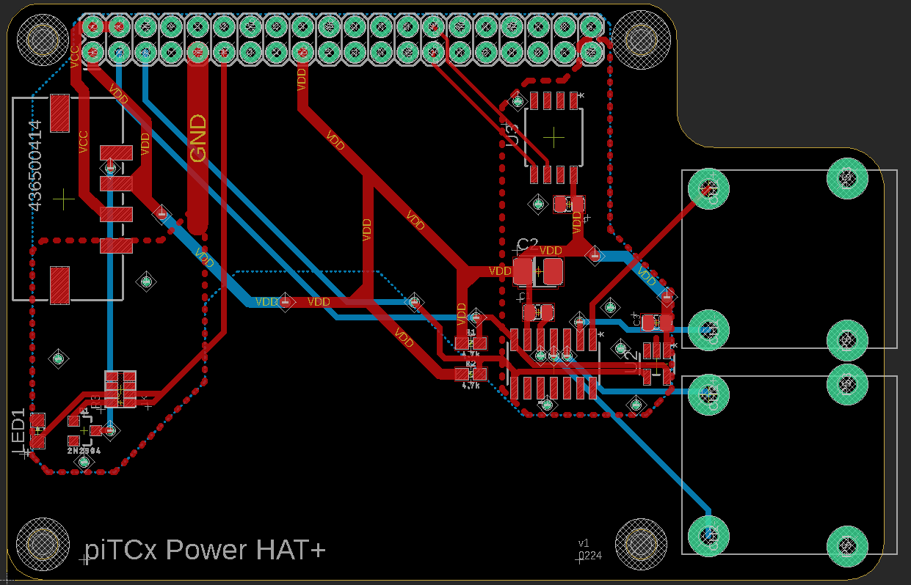
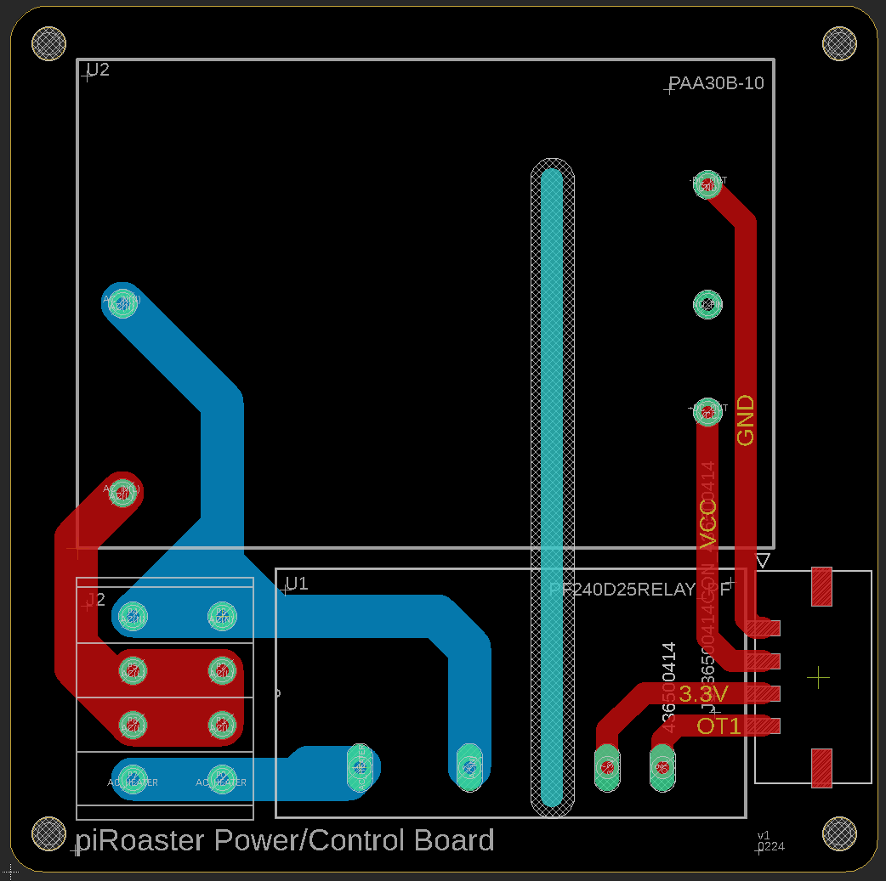
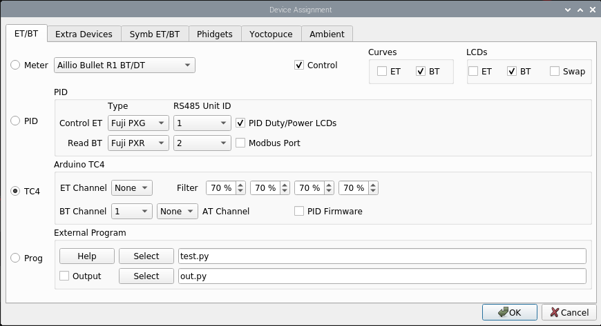
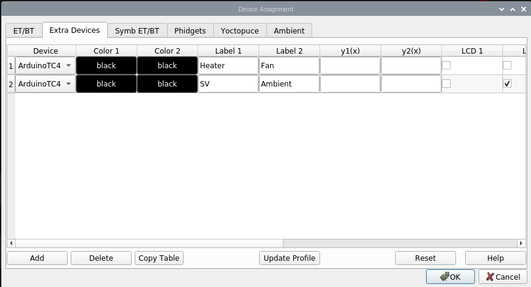
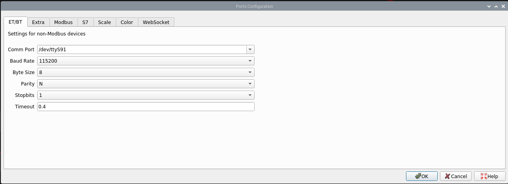
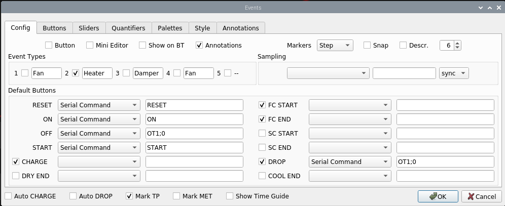
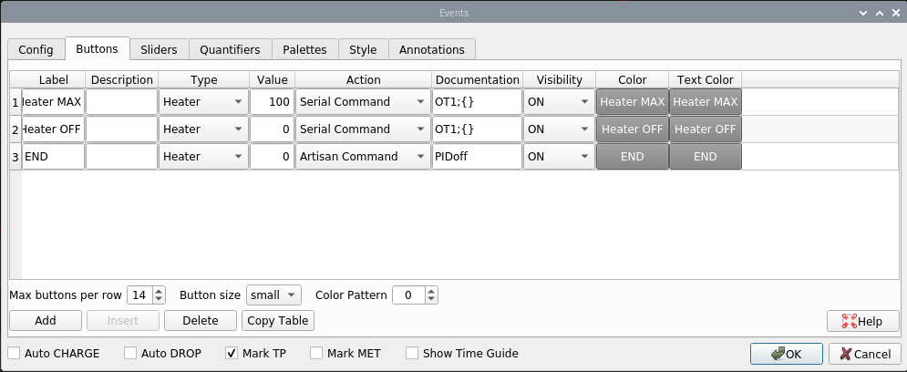
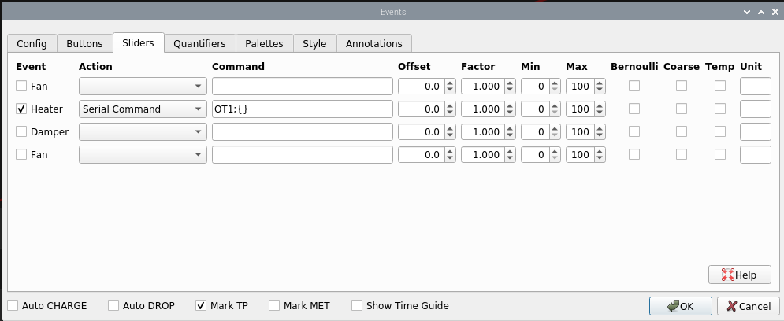
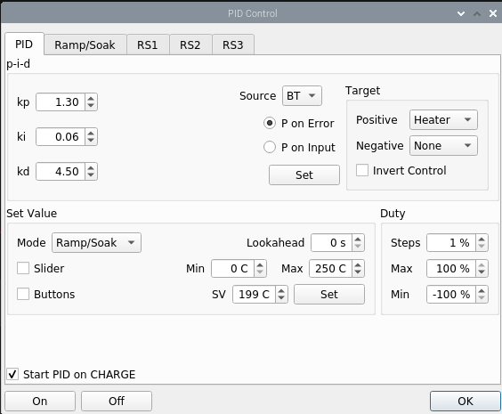

# piTCx
piTCx is a Raspberry Pi based roaster control system using Artisan Roasterscope as front-end UI. A Raspberry Pi can interface with the piTCx Power HAT+ to record temperatures from up to four thermocouples as well as the temperature sensor (MCP9800) on the piTCx board. For roaster control, the Raspberry Pi can perform heater control using slow PWM (1 Hz) with the Artisan software providing PID control. Heater control requires a solid state relay connected to the OT1 jumper on the piTCx HAT+. The piTCx Power HAT+ can also power the host Raspberry Pi over GPIO through the 5V jumper connection.



# piRoast Power
The piRoast Power is a complementary board provides  5V power to supply the Raspberry Pi via the piTCx Power HAT+. Additionally, the board contains a solid state relay for heater control.



## Raspberry Pi Setup
Starting with a fresh install of the latest raspbian OS (tested with Bookworm):

1. configure the raspi with
```
sudo raspi-config
```    
In the "Advanced" menu, select expand filesystem.

In the "Interfaces" menu enable ssh, I2C, Serial Port, and Remote GPIO.

Reboot to finish the configuration.

2. Install required tools
```
sudo apt install socat
```
3. Ensure pigpiod is enabled and running
```
sudo systemctl enable pigpiod
sudo systemctl start pigpiod
```
4. Install Artisan
```
curl -L -O https://github.com/artisan-roaster-scope/artisan/releases/download/<vx.xx.x>/<artisan-linux-x.xx.x.deb>
sudo dpkg -i <artisan-linux-x.x.x.deb>
```
5. Download and setup the piTCx code
```
git clone https://github.com/dfunni/piTCx.git
cd piTCx
python -m venv env
source env/bin/activate
pip install -r requirements.txt
```
6. Create systemd service to run the piTCx command interface. First update tcxd.service line 10 to the correct login user (e.g. pi). Then:
```
sudo cp tcxd.service /etc/systemd/system/
sudo sytemctl enable tcxd.service
```
From here everything is setup and ready. The next steps are to configure Artisan for communication with the TCx board.

## Artisan Setup
1. Go to Config > Device
    - at the top of the ET/BT tab check Control, Curves: BT, LCDs: ET and BT
    - select TC4 radio button, set ET and BT channels, set AT Channel to None, deselect PID Firmware
    - in the Extra Devices tab add the following:
        ArduinoTC4_56; Label 1: Heater; Label 2: Fan; Curve 1: enable; Curve 2: enable
        ArduinoTC4_78; Label 1: SV; Label 2: Ambient; LCD 2: enable; Curve 1: enable; Curve 2: enable





2. In Ports set Comm Port to /dev/ttyS91 with 115200-8-N-1 and change the serial Timeout to **0.4** seconds



3. Config > Sampling set to 1.0 seconds, accept the popup

4. Config > Curves select BT Projection and set to linear

5. Config > Events
     - set Event Types 2 to Heater and have that as the only event tyupe slected
     - set Default Buttons - DROP to Serial Command: OT1;0
     - under the Buttons Tab add the following
        Heater MAX; Type: Heater; Value: 100; Action: Serial Command; Documentation: OT1;{}
        Heater Off; Type: Heater; Value: 0; Action: Serial Command; Documentation: OT1;{}
        PID OFF; Type: Heater Value: 0; Action: Artisan Command; Documentation: PIDoff
    - Sliders - Event: Heater; Action: Serial Command; Command: OT1;{}

    

    

    

6. Config > Temperature > Celcius Mode

7. Roast > Background
    - show, BT selected
    - Load background .alog file

8. Control (Button)
    - kp: 1.30
    - ki: 0.06
    - kd: 4.50
    - Source: BT; Target - Positive: Heater; Set Value - Mode: Background; Set PID on CHARGE: enabled



## Launch Artisan on boot
Copy `start_artisan.sh` to `/etc/profile.d/` with:

    sudo cp $HOME/piTCx/start_artisan.sh /etc/profile.d/

## Testing piTCx on standalone Raspberry Pi
1. Ensure Raspberry Pi setup is completed per instructions in Raspberry Pi Setup
  section. Ensure piTCx HAT+ is connected.

3. In the ~/piTCx directory run pytests with:
```
cd ~/piTCx
pytest --cov
```

3. Navigate to the ~/piTCx/tests/ directory and run:
```
cd tests/
./integration_test.sh
```
Monitor the output to ensure temperatures are read, no errors are produced.

4. Run the sample rate test to ensure 1.0 second sampling intervals are working:
```
./samprate_test.sh
```
Monitor the output to esure 10 reads are taken. Check the timestamps for 1 second accuracy. 

5. Additionally, a single Artisan command can be executed with:
```
./ArtisonCMD.sh <command> [<value>]
```
 using a command value pair from the following:
| command | value | notes |
| ------- | ----- | ----- |
| CHAN    | 1234  | Initializes the piTCx and sets order of ADC channels |
| READ    |       | No value for READ command |
| UNITS   | F/C   | Temperature units to be read |
| OT1     | 0-100 | Sets OT1 duty cycle |
| OT2     | 0-100 | Sets OT2 duty cycle |
| IO2     | 0-100 | Sets IO2 duty cycle | 

